Pebblefoot is a tool to help you leave Spotify. It can transfer your existing playlists to YouTube Music or download them locally and automatically rename and tag them so they look nice and clean in your Mp3 player :).

▄▄▄▄ ▗▞▀▚▖▗▖ ▗▖ █ ▗▞▀▚▖▗▞▀▀▘▄▄▄ ▄▄▄ ■  
█ █ ▐▛▀▀▘▐▌ ▐▌ █ ▐▛▀▀▘▐▌ █ █ █ █ ▗▄▟▙▄▖
█▄▄▄▀ ▝▚▄▄▖▐▛▀▚▖▐▛▀▚▖█ ▝▚▄▄▖▐▛▀▘▀▄▄▄▀ ▀▄▄▄▀ ▐▌  
█ ▐▙▄▞▘▐▙▄▞▘█ ▐▌ ▐▌  
▀ ▐▌

(I made this tool for my girlfriend now that we don't live in the same city and I can't download music for her to put on her MP3 player. And she doesn't know shit about computers. Hence the big tutorial. <33)

# Installation

You need to make sure you have FFMPEG installed first. If you already have it installed and have added it to 'Path', continue to the next chapter.

## FFMPEG

### For tech people

Hopefully you already have FFMPEG installed. If not... why?

### For noobs

Go to https://ffmpeg.org/download.html

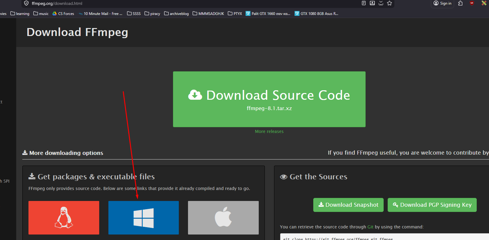
Click the Windows button and the second options in 'Builds'
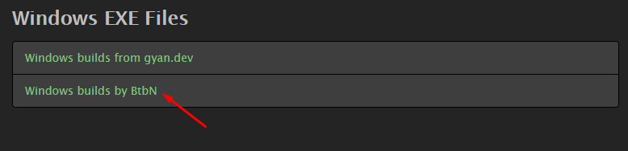

Download it and extract it somewhere where it **won't be deleted** (for example, NOT your Downloads folder).

Then, go to the extracted folder, right-click on the subfolder named 'bin' and copy the path (or ctrl+shift+c).
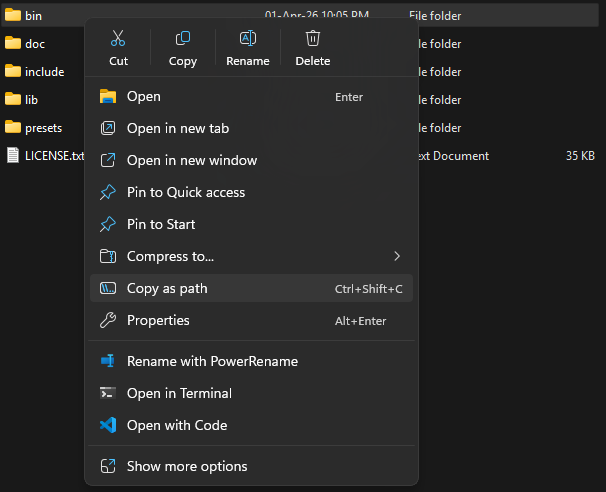

Otherwise you can also click into the 'bin' folder and cope the path from the top bar.
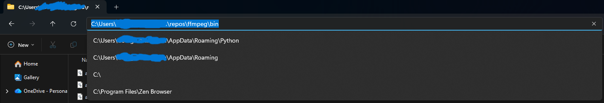

In your computer, open environment variables:
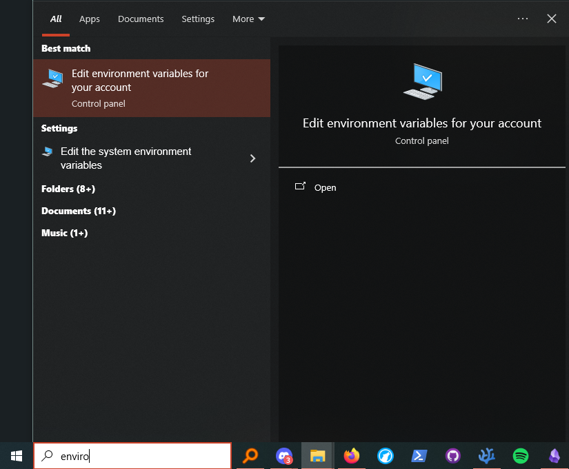
Click on 'Environment Variables' and look for the 'Path' one. Press 'New':
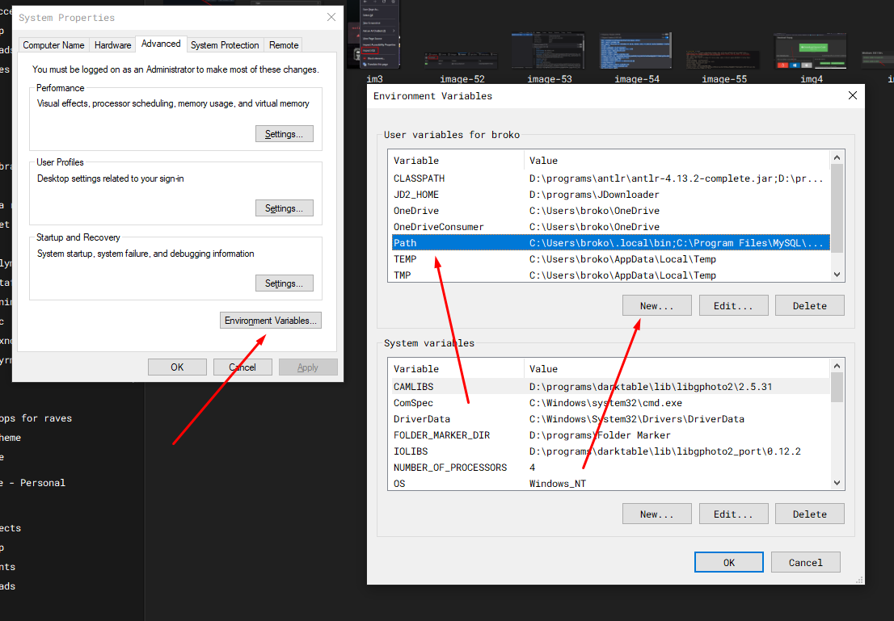
Then press 'New' again and paste that address in. Press 'Ok' and 'Apply' at the end and close the 'Environment Variables' window.
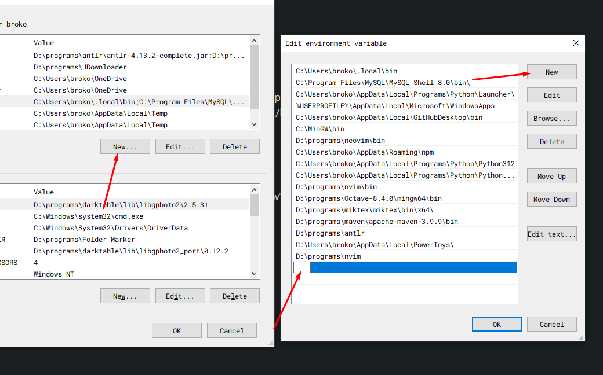

Should be good :]].

## Pebblefoot

### For tech people

Just clone the directory and run:

```bash
pip install -r requirements.txt
```

If any module is missing (that happens sometimes), you should be able to manually install it with pip again.

### For noobs

First, download all the files in here (you can just download as a .zip and extract them).
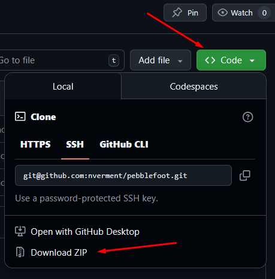

Then put them in a folder - keep in mind that whatever music you download will be saved to a subfolder of the current one.

**For Windows:**
Go to the folder where your files are, right-click and press 'Open in Terminal'.
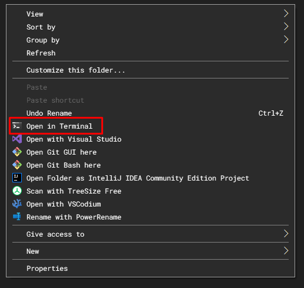

**For Mac:**
Open the 'Terminal' app and navigate to your folder (the one where you saved the tool) using the following commands:

- `cd` - go to this folder
- `ls` - look inside this folder

So, you will do something like:

```
>>> ls
	\music
	\pictures
	(^^ this will show you the files and folders in the folder you are currently in)
>>> cd \music
```

Then finally run this command:

```bash
pip install -r requirements.txt
```

Done!

# Setup

Before running, you need to open YouTube Music and log in. Right click on the page and press Inspect, or just press the F12 key.

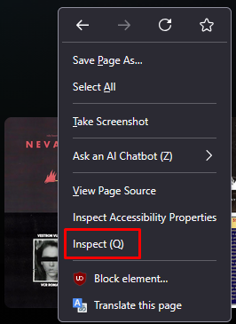

Then, on your browser, go to the network tab like so. If you don't see any requests (noob translation: the little cells on the table from the img/image) just reload the page or click on something on it (like a playlist of yours). We are looking for the 'browse' request, it helps if you put the word itself on the 'filter' bar (boxed in red in the img/image below).
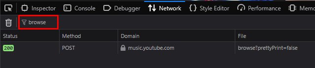

Click on it, and you should see something like this:
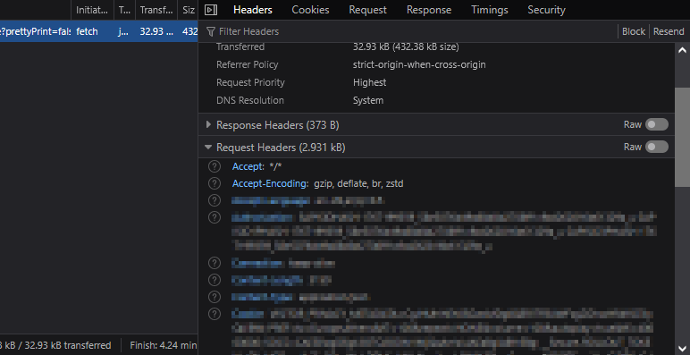

We want the **Request Headers**. Just click on the 'Raw' toggle and copy everything underneath.
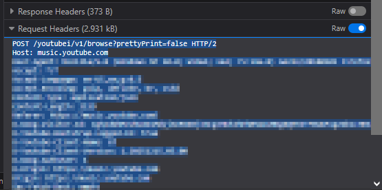

In the folder of the project you will find a text file called 'Headers.txt'.
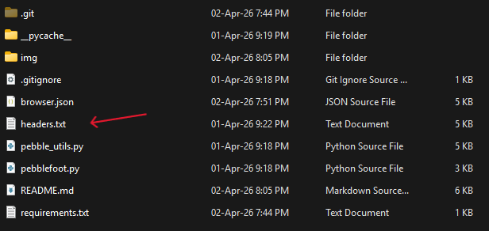

Open it, paste the text that you just copied from youtube music and save it.

You are good to go!

**Notes**

- Because these headers reset every now and then, you will also need to do this every now and then. So if you see an error like 'browser.json file does not exist', this is your sign. I usually do it once before each session of using the tool and transfer a lot of playlists without the need to re-do it unless I leave it unattended for an hour or so.

# Usage

Basic command is as follows:

```bash
python pebblefoot.py [-h] -u URL [-n NAME] [-m {d,t}]
```

Flags are as follows:

- `-h` Show help.
- `-u` Spotify playlist URL.
- `-n` Name of output playlist - simply, what the folder you download OR the new YTMusic playlist will be named
- `-m` Mode. Offers 2 options: [d] for local download and [t] for transfer to YTMusic.

Enjoy!
